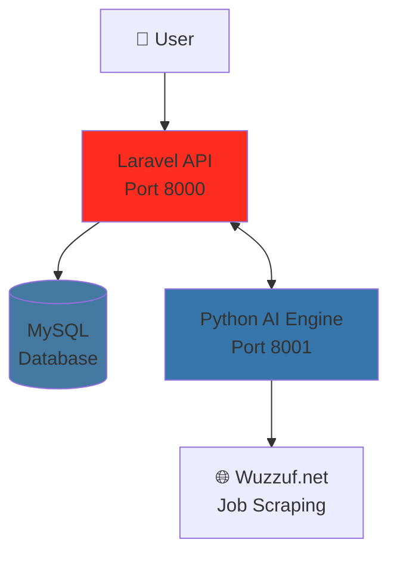
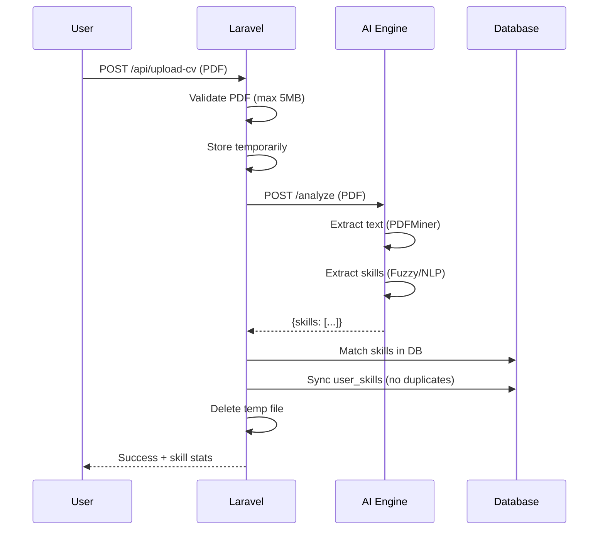
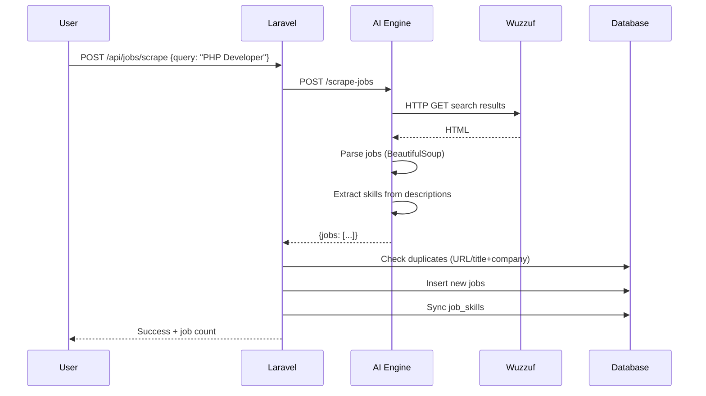

# CareerCompass 🧭

> **Graduation Project**: AI-powered career guidance platform using microservices architecture

## 📋 Overview

CareerCompass is a comprehensive career development platform that helps users identify skill gaps by analyzing their CVs against real job market requirements. Built with Laravel and Python/FastAPI microservices.

---

## 🏗️ Architecture



### Components

| Component       | Technology     | Port | Purpose                                         |
| --------------- | -------------- | ---- | ----------------------------------------------- |
| **Backend API** | Laravel 12     | 8000 | User management, authentication, business logic |
| **AI Engine**   | Python/FastAPI | 8001 | CV parsing, skill extraction, job scraping      |
| **Database**    | MySQL          | 3306 | Data persistence                                |

---

## 📁 Project Structure

```
CareerCompass/
├── backend-api/              # Laravel 12 Application
│   ├── app/
│   │   ├── Http/
│   │   │   ├── Controllers/Api/
│   │   │   │   ├── AuthController.php      # Registration, login, logout
│   │   │   │   ├── CvController.php        # CV upload & analysis
│   │   │   │   └── JobController.php       # Job browsing & scraping
│   │   │   ├── Requests/
│   │   │   │   └── CvUploadRequest.php     # CV validation
│   │   │   └── Resources/
│   │   │       ├── SkillResource.php       # Skill JSON formatting
│   │   │       └── JobResource.php         # Job JSON formatting
│   │   └── Models/
│   │       ├── User.php                    # User model + skills relation
│   │       ├── Skill.php                   # Skill model
│   │       └── Job.php                     # Job model
│   ├── database/
│   │   ├── migrations/
│   │   │   ├── *_create_skills_table.php
│   │   │   ├── *_create_jobs_table.php
│   │   │   ├── *_create_job_skills_table.php
│   │   │   └── *_create_user_skills_table.php
│   │   └── seeders/
│   │       └── SkillSeeder.php             # 84 predefined skills
│   ├── routes/
│   │   └── api.php                         # 11 API endpoints
│   └── TESTING.md                          # API testing guide
│
├── ai-engine/                # Python FastAPI Service
│   ├── main.py                             # FastAPI app (7 endpoints)
│   ├── parser.py                           # PDF text extraction
│   ├── extractor.py                        # Skill extraction (NLP + fuzzy)
│   ├── scraper.py                          # Wuzzuf job scraping
│   ├── requirements.txt                    # Python dependencies
│   ├── test_engine.py                      # CV analysis tests
│   └── test_scraper.py                     # Job scraper tests
│
└── README.md                 # This file
```

---

## 🚀 Getting Started

### Prerequisites

- **PHP** 8.1+
- **Composer** 2.x
- **Node.js** 18+ (for Laravel assets)
- **Python** 3.11+
- **MySQL** 8.x
- **Git**

### Installation

#### 1. Clone Repository

```bash
git clone <repository-url>
cd CareerCompass
```

#### 2. Backend API (Laravel)

```bash
cd backend-api

# Install dependencies
composer install

# Configure environment
cp .env.example .env
php artisan key:generate

# Update .env with your database credentials
# DB_DATABASE=careercompass
# DB_USERNAME=root
# DB_PASSWORD=your_password

# Run migrations and seed skills
php artisan migrate
php artisan db:seed

# Install Sanctum (already done)
php artisan install:api
```

#### 3. AI Engine (Python)

```bash
cd ai-engine

# Create virtual environment
python -m venv venv

# Activate virtual environment
venv\Scripts\activate        # Windows
source venv/bin/activate     # macOS/Linux

# Install dependencies
pip install -r requirements.txt

# Download spaCy model (optional, for NLP)
python -m spacy download en_core_web_sm
```

---

## ▶️ Running the Application

### Start Both Services

**Terminal 1 - Laravel API:**

```bash
cd backend-api
php artisan serve --port=8000
# API available at http://127.0.0.1:8000
```

**Terminal 2 - Python AI Engine:**

```bash
cd ai-engine
venv\Scripts\activate  # or source venv/bin/activate
uvicorn main:app --reload --port 8001
# AI Engine available at http://127.0.0.1:8001
```

**Access API Documentation:**

- Laravel Health Check: http://127.0.0.1:8000/api/health
- AI Engine Docs: http://127.0.0.1:8001/docs (Swagger UI)

---

## 🔌 API Endpoints

### Authentication (Public)

| Method | Endpoint        | Description             |
| ------ | --------------- | ----------------------- |
| POST   | `/api/register` | Create new user account |
| POST   | `/api/login`    | Login and get token     |

### User & Skills (Protected)

| Method | Endpoint                | Auth | Description                    |
| ------ | ----------------------- | ---- | ------------------------------ |
| GET    | `/api/user`             | ✅   | Get current user               |
| POST   | `/api/logout`           | ✅   | Logout (revoke tokens)         |
| POST   | `/api/upload-cv`        | ✅   | Upload CV for skill extraction |
| GET    | `/api/user/skills`      | ✅   | View user's skills             |
| DELETE | `/api/user/skills/{id}` | ✅   | Remove a skill                 |

### Jobs (Public + Protected)

| Method | Endpoint           | Auth | Description                 |
| ------ | ------------------ | ---- | --------------------------- |
| GET    | `/api/jobs`        | ❌   | Browse all jobs (paginated) |
| GET    | `/api/jobs/{id}`   | ❌   | View single job details     |
| POST   | `/api/jobs/scrape` | ✅   | Trigger job scraping        |

### Gap Analysis (Protected)

| Method | Endpoint                            | Auth | Description                            |
| ------ | ----------------------------------- | ---- | -------------------------------------- |
| GET    | `/api/gap-analysis/job/{id}`        | ✅   | Analyze match with specific job        |
| POST   | `/api/gap-analysis/batch`           | ✅   | Batch analyze multiple jobs            |
| GET    | `/api/gap-analysis/recommendations` | ✅   | Get personalized skill recommendations |

### AI Engine Endpoints

| Method | Endpoint              | Description                   |
| ------ | --------------------- | ----------------------------- |
| GET    | `/`                   | Health check                  |
| GET    | `/skills`             | List all predefined skills    |
| POST   | `/analyze`            | Analyze CV and extract skills |
| POST   | `/extract-text`       | Extract raw text from PDF     |
| POST   | `/scrape-jobs`        | Scrape jobs from Wuzzuf       |
| GET    | `/scrape-jobs/status` | Scraper service status        |

---

## 📊 Database Schema

```mermaid
erDiagram
    USERS ||--o{ USER_SKILLS : has
    SKILLS ||--o{ USER_SKILLS : belongs_to
    SKILLS ||--o{ JOB_SKILLS : belongs_to
    JOBS ||--o{ JOB_SKILLS : requires

    USERS {
        int id PK
        string name
        string email
        string password
        timestamps
    }

    SKILLS {
        int id PK
        string name
        enum type "technical,soft"
        timestamps
    }

    JOBS {
        int id PK
        string title
        string company
        text description
        string url
        string source
        timestamps
    }

    USER_SKILLS {
        int user_id FK
        int skill_id FK
        timestamps
    }

    JOB_SKILLS {
        int job_id FK
        int skill_id FK
    }
```

### Predefined Skills

- **84 Total Skills**
  - 66 Technical Skills (PHP, Laravel, Python, React, Docker, etc.)
  - 18 Soft Skills (Communication, Teamwork, Leadership, etc.)

---

## 🔄 System Flows

### CV Upload Flow



### Job Scraping Flow



---

## 🧪 Testing

### Test AI Engine

```bash
cd ai-engine
python test_engine.py      # Test CV analysis
python test_scraper.py     # Test job scraping
```

### Test Laravel API

See [TESTING.md](backend-api/TESTING.md) for detailed testing instructions.

**Quick Test:**

```bash
# Register user
curl -X POST http://127.0.0.1:8000/api/register \
  -H "Content-Type: application/json" \
  -d '{"name":"Test User","email":"test@example.com","password":"password123","password_confirmation":"password123"}'

# Login and get token
curl -X POST http://127.0.0.1:8000/api/login \
  -H "Content-Type: application/json" \
  -d '{"email":"test@example.com","password":"password123"}'
```

---

## ✨ Features

### ✅ All Phases Complete (1-6)

- [x] **Project Setup** - Git, Laravel, Python structure
- [x] **Database Design** - Migrations, models, relationships
- [x] **AI Engine** - CV parsing, skill extraction (PDFMiner + spaCy)
- [x] **Backend API** - Auth (Sanctum), CV upload, skill management
- [x] **Job Scraper** - Wuzzuf scraping, sample jobs, storage
- [x] **Gap Analysis** - Match calculation, batch analysis, recommendations

### 🚧 Future Enhancements

- [ ] **Frontend Dashboard** - React/Vue.js UI
- [ ] **Learning Resources** - Link skills to courses (Udemy, Coursera)
- [ ] **Career Paths** - Multi-step job progression planning
- [ ] **Skill Proficiency** - Track beginner/intermediate/expert levels
- [ ] **Job Alerts** - Email notifications for matching jobs
- [ ] **Mobile App** - React Native implementation

---

## 🛠️ Technologies

### Backend

- **Laravel 12** - PHP framework
- **MySQL** - Database
- **Laravel Sanctum** - API authentication
- **Eloquent ORM** - Database relationships

### AI Engine

- **FastAPI** - Modern Python web framework
- **PDFMiner.six** - PDF text extraction
- **spaCy** - NLP for skill extraction
- **BeautifulSoup4** - Web scraping
- **FuzzyWuzzy** - Fuzzy string matching
- **Uvicorn** - ASGI server

### Tools

- **Git** - Version control
- **Composer** - PHP dependency management
- **Pip** - Python package manager
- **Postman** - API testing

---

## 📝 Development Notes

### Key Design Decisions

1. **Microservices Architecture**: Separates concerns - Laravel handles business logic, Python handles AI/ML
2. **Sanctum over Passport**: Simpler token-based auth for SPA/mobile apps
3. **Fuzzy Matching Default**: Faster than NLP, good enough for most cases
4. **Sample Jobs**: Enables testing without actual web scraping
5. **Duplicate Prevention**: URL-based primary, title+company fallback
6. **Pivot Timestamps**: Track when skills/jobs were added

### Environment Variables

**Laravel (.env):**

```env
AI_ENGINE_URL=http://127.0.0.1:8001
AI_ENGINE_TIMEOUT=30
```

**Python (defaults in code):**

- `REQUEST_DELAY=2` (seconds between requests)
- `TIMEOUT=10` (request timeout)
- `USER_AGENT="Mozilla/5.0..."`

---

## 🐛 Troubleshooting

### Laravel Server Won't Start

```bash
php artisan config:clear
php artisan cache:clear
php artisan route:clear
```

### AI Engine Import Errors

```bash
cd ai-engine
venv\Scripts\activate
pip install -r requirements.txt --upgrade
```

### Database Connection Error

- Check MySQL is running
- Verify `.env` credentials
- Run `php artisan migrate:fresh --seed`

### Scraping Returns Empty

- Check internet connection
- Website structure may have changed (update selectors in `scraper.py`)
- Use `use_samples: true` for testing

---

## 📚 Documentation

- **API Testing Guide**: [backend-api/TESTING.md](backend-api/TESTING.md)
- **AI Engine Docs**: http://127.0.0.1:8001/docs (when running)
- **Implementation Plans**: See `.gemini/antigravity/brain/` directory
- **Walkthrough Reports**: See conversation artifacts

---

## 🤝 Contributing

This is a graduation project. For questions or collaboration:

1. Fork the repository
2. Create a feature branch (`git checkout -b feature/amazing-feature`)
3. Commit your changes (`git commit -m 'Add amazing feature'`)
4. Push to the branch (`git push origin feature/amazing-feature`)
5. Open a Pull Request

---

## 📄 License

MIT License - See LICENSE file for details

---

## 👥 Authors

- **Student Name** - Graduation Project 2026
- **Supervisor** - [Name]

---

## 🙏 Acknowledgments

- Laravel Community
- FastAPI Team
- spaCy NLP Library
- Wuzzuf (job listings source)

---

**Last Updated**: February 2026  
**Project Status**: ✅ **All 6 Phases Complete - Production Ready MVP**  
**API Endpoints**: 21 total (14 Laravel + 7 Python)  
**Next Milestone**: Frontend Development

---

## 📦 Quick Start Summary

```bash
# 1. Start Laravel (Terminal 1)
cd backend-api && php artisan serve --port=8000

# 2. Start AI Engine (Terminal 2)
cd ai-engine && venv\Scripts\activate && uvicorn main:app --reload --port 8001

# 3. Import CareerCompass.postman_collection.json into Postman

# 4. Test the flow:
#    - Register/Login → Upload CV → Scrape Jobs → Analyze Gap → Get Recommendations
```
