# CareerCompass 🧭

> **Graduation Project**: AI-powered career guidance platform using microservices architecture with React frontend

## 📋 Overview

CareerCompass is an **advanced AI-powered career development platform** that combines intelligent CV analysis, real-time job market scraping, and smart skill gap analysis to help users make data-driven career decisions. The platform features:

- **Market Intelligence System**: Automated job scraping with skill importance ranking (Essential/Important/Nice-to-have)
- **On-Demand Job Data**: Real-time job scraping with background queue processing
- **Smart Gap Analysis**: Priority-based skill roadmap with market demand insights
- **Modern Architecture**: React frontend, Laravel backend with queue workers, Python AI engine

---

## 🏗️ Architecture

```mermaid
graph TB
    User[👤 User] --> Frontend[React Frontend<br/>Port 5173]
    Frontend --> Laravel[Laravel API<br/>Port 8000]
    Laravel --> Queue[Queue Worker<br/>Background Jobs]
    Laravel --> MySQL[(MySQL<br/>Database)]
    Laravel --> Redis[(Redis Cache<br/>& Queues)]
    Laravel <--> AI[Python AI Engine<br/>Port 8001]
    AI --> Wuzzuf[🌐 Wuzzuf.net<br/>Job Scraping]
    Queue --> Laravel
    Scheduler[Laravel Scheduler<br/>Automated Tasks] --> Queue

    style Frontend fill:#61dafb
    style Laravel fill:#ff2d20
    style AI fill:#3776ab
    style MySQL fill:#4479a1
    style Redis fill:#dc382d
    style Queue fill:#00d084
```



### Components

| Component        | Technology      | Port | Purpose                                           |
| ---------------- | --------------- | ---- | ------------------------------------------------- |
| **Frontend**     | React 19 + Vite | 5173 | User interface, dashboard, authentication         |
| **Backend API**  | Laravel 12      | 8000 | User management, authentication, business logic   |
| **Queue Worker** | Laravel Queue   | -    | Background processing for scraping & calculations |
| **AI Engine**    | Python/FastAPI  | 8001 | CV parsing, skill extraction, job scraping        |
| **Database**     | MySQL           | 3306 | Data persistence                                  |
| **Cache/Queue**  | Redis (opt)     | 6379 | Fast caching and queue management (production)    |
| **Scheduler**    | Laravel Cron    | -    | Automated market data updates (twice weekly)      |

---

## 📁 Project Structure

```
CareerCompass/
├── frontend/                 # React 19 + Vite Application
│   ├── src/
│   │   ├── components/
│   │   │   ├── Layout.jsx                  # Main layout wrapper
│   │   │   ├── Navbar.jsx                  # Navigation bar
│   │   │   ├── ProtectedRoute.jsx          # Route guard
│   │   │   └── ... (UI components)
│   │   ├── pages/
│   │   │   ├── Login.jsx                   # Login page
│   │   │   ├── Register.jsx                # Registration page
│   │   │   ├── Dashboard.jsx               # Main dashboard
│   │   │   ├── CVUpload.jsx                # CV upload interface
│   │   │   ├── MySkills.jsx                # User skills management
│   │   │   ├── Jobs.jsx                    # Job listings
│   │   │   └── GapAnalysis.jsx             # Skill gap analysis
│   │   ├── services/
│   │   │   └── api.js                      # Axios API client
│   │   ├── App.jsx                         # Root component
│   │   └── main.jsx                        # Entry point
│   ├── public/                             # Static assets
│   ├── package.json                        # NPM dependencies
│   ├── vite.config.js                      # Vite configuration
│   ├── tailwind.config.js                  # Tailwind CSS config
│   ├── FRONTEND_DOCUMENTATION.md           # Frontend docs
│   └── DEVELOPER_GUIDE.md                  # Development guide
│
├── backend-api/              # Laravel 12 Application
│   ├── app/
│   │   ├── Http/
│   │   │   ├── Controllers/Api/
│   │   │   │   ├── AuthController.php              # Registration, login, logout
│   │   │   │   ├── CvController.php                # CV upload & analysis
│   │   │   │   ├── JobController.php               # Job browsing, scraping, on-demand scraping
│   │   │   │   ├── GapAnalysisController.php       # Enhanced gap analysis with priorities
│   │   │   │   └── MarketIntelligenceController.php # Market statistics & trends
│   │   │   ├── Requests/
│   │   │   │   └── CvUploadRequest.php             # CV validation
│   │   │   └── Resources/
│   │   │       ├── SkillResource.php               # Skill JSON formatting
│   │   │       └── JobResource.php                 # Job JSON formatting
│   │   ├── Jobs/
│   │   │   ├── ProcessMarketScraping.php           # Automated market data scraping
│   │   │   └── ProcessOnDemandJobScraping.php      # On-demand job scraping
│   │   ├── Console/Commands/
│   │   │   ├── ScrapeJobs.php                      # Manual scraping command
│   │   │   └── CalculateSkillImportance.php        # Skill importance calculation
│   │   └── Models/
│   │       ├── User.php                            # User model + skills relation
│   │       ├── Skill.php                           # Skill model
│   │       ├── Job.php                             # Job model with importance
│   │       ├── JobRoleStatistic.php                # Market statistics per role
│   │       └── ScrapingJob.php                     # Scraping job tracking
│   ├── database/
│   │   ├── migrations/
│   │   │   ├── *_create_skills_table.php
│   │   │   ├── *_create_jobs_table.php
│   │   │   ├── *_create_job_skills_table.php
│   │   │   ├── *_add_skill_importance_to_job_skills.php
│   │   │   ├── *_create_job_role_statistics_table.php
│   │   │   ├── *_create_scraping_jobs_table.php
│   │   │   └── *_create_user_skills_table.php
│   │   └── seeders/
│   │       └── SkillSeeder.php                     # 84 predefined skills
│   ├── routes/
│   │   ├── api.php                                 # API endpoints
│   │   └── console.php                             # Scheduler configuration
│   └── TESTING.md                          # API testing guide
│
├── ai-engine/                # Python FastAPI Service
│   ├── main.py                             # FastAPI app (7 endpoints)
│   ├── parser.py                           # PDF text extraction
│   ├── extractor.py                        # Enhanced skill extraction (NLP + fuzzy)
│   ├── scraper.py                          # Job scraping + frequency analysis
│   ├── requirements.txt                    # Python dependencies
│   ├── test_engine.py                      # CV analysis tests
│   └── test_scraper.py                     # Job scraper tests
│
├── docs/
│   ├── FRONTEND_INTEGRATION.md             # React components guide
│   └── PRODUCTION_DEPLOYMENT.md            # Production setup guide
├── start_all.bat             # Windows launcher (4 services + queue worker)
├── CareerCompass.postman_collection.json   # Postman API collection (30+ endpoints)
└── README.md                 # This file
```

---

## 🚀 Getting Started

### Prerequisites

Make sure you have the following installed on your system:

- **PHP** 8.1+ with extensions: `pdo`, `pdo_mysql`, `mbstring`, `xml`, `curl`, `zip`
- **Composer** 2.x - [Download](https://getcomposer.org/)
- **Node.js** 18+ and npm - [Download](https://nodejs.org/)
- **Python** 3.11+ - [Download](https://www.python.org/)
- **MySQL** 8.x - [Download](https://dev.mysql.com/downloads/installer/)
- **Git** - [Download](https://git-scm.com/)

### Installation

> **💡 Quick Tip**: After installation, you can use `start_all.bat` (Windows) to launch all services at once!

#### 1️⃣ Clone Repository

```bash
git clone https://github.com/yourusername/CareerCompass.git
cd CareerCompass
```

#### 2️⃣ Setup Database

Create a MySQL database for the project:

```sql
CREATE DATABASE careercompass;
```

Or use your preferred MySQL client (phpMyAdmin, MySQL Workbench, etc.)

#### 3️⃣ Frontend Setup (React + Vite)

```bash
cd frontend

# Install dependencies
npm install

# Configuration (optional)
# Edit src/services/api.js if backend is not on http://127.0.0.1:8000
```

The frontend will automatically connect to the Laravel API at `http://127.0.0.1:8000/api`.

#### 4️⃣ Backend API Setup (Laravel)

```bash
cd backend-api

# Install PHP dependencies
composer install

# Create environment file
cp .env.example .env

# Generate application key
php artisan key:generate
```

**Configure `.env` file** - Open `backend-api/.env` and update:

```env
# Database Configuration
DB_CONNECTION=mysql
DB_HOST=127.0.0.1
DB_PORT=3306
DB_DATABASE=careercompass
DB_USERNAME=root
DB_PASSWORD=your_mysql_password

# Queue Configuration (use 'database' for development, 'redis' for production)
QUEUE_CONNECTION=database

# AI Engine Configuration
AI_ENGINE_URL=http://127.0.0.1:8001
AI_ENGINE_TIMEOUT=60

# Frontend URL (for CORS)
FRONTEND_URL=http://localhost:5173
```

**Run migrations and seed database:**

```bash
# Create database tables
php artisan migrate

# Seed with 84 predefined skills
php artisan db:seed --class=SkillSeeder

# Or run both at once
php artisan migrate:fresh --seed
```

#### 5️⃣ AI Engine Setup (Python + FastAPI)

```bash
cd ai-engine

# Create virtual environment
python -m venv venv

# Activate virtual environment
venv\Scripts\activate        # Windows
source venv/bin/activate     # macOS/Linux

# Install Python dependencies
pip install -r requirements.txt

# Download spaCy language model (optional but recommended)
python -m spacy download en_core_web_sm
```

---

## ▶️ Running the Application

### 🎯 Option 1: Automated Launcher (Windows Only - Recommended)

The easiest way to start all services on Windows:

```bash
# From the project root directory
start_all.bat
```

This will launch **four** separate terminal windows:

- **Frontend** (React) - http://localhost:5173
- **Backend API** (Laravel) - http://127.0.0.1:8000
- **AI Engine** (Python) - http://127.0.0.1:8001
- **Queue Worker** (Laravel) - Background job processing

### 🔧 Option 2: Manual Start (All Operating Systems)

Open **four separate terminal windows** and run each service:

**Terminal 1 - Frontend (React + Vite):**

```bash
cd frontend
npm run dev
# Frontend available at http://localhost:5173
```

**Terminal 2 - Backend API (Laravel):**

```bash
cd backend-api
php artisan serve --port=8000
# API available at http://127.0.0.1:8000
```

**Terminal 3 - AI Engine (Python + FastAPI):**

```bash
cd ai-engine
venv\Scripts\activate        # Windows
# OR
source venv/bin/activate     # macOS/Linux

uvicorn main:app --reload --port 8001
# AI Engine available at http://127.0.0.1:8001
```

**Terminal 4 - Queue Worker (Laravel):**

```bash
cd backend-api
php artisan queue:work --queue=high,default --tries=3 --timeout=300
# Queue Worker processing background jobs
```

### ✅ Verify Everything is Running

Once all services are started, check the following URLs:

| Service     | URL                              | Expected Response       |
| ----------- | -------------------------------- | ----------------------- |
| Frontend    | http://localhost:5173            | React login/register UI |
| Backend API | http://127.0.0.1:8000/api/health | `{"status": "ok"}`      |
| AI Engine   | http://127.0.0.1:8001            | `{"message": "ok"}`     |
| AI Engine   | http://127.0.0.1:8001/docs       | Swagger UI              |

---

## 🔌 API Endpoints

### Authentication (Public)

| Method | Endpoint        | Description             |
| ------ | --------------- | ----------------------- |
| POST   | `/api/register` | Create new user account |
| POST   | `/api/login`    | Login and get token     |

### User & Skills (Protected)

| Method | Endpoint                | Auth | Description                    |
| ------ | ----------------------- | ---- | ------------------------------ |
| GET    | `/api/user`             | ✅   | Get current user               |
| POST   | `/api/logout`           | ✅   | Logout (revoke tokens)         |
| POST   | `/api/upload-cv`        | ✅   | Upload CV for skill extraction |
| GET    | `/api/user/skills`      | ✅   | View user's skills             |
| DELETE | `/api/user/skills/{id}` | ✅   | Remove a skill                 |

### Jobs (Public + Protected)

| Method | Endpoint                       | Auth | Description                            |
| ------ | ------------------------------ | ---- | -------------------------------------- |
| GET    | `/api/jobs`                    | ❌   | Browse all jobs (paginated)            |
| GET    | `/api/jobs/{id}`               | ❌   | View single job details                |
| POST   | `/api/jobs/scrape`             | ✅   | Trigger job scraping                   |
| POST   | `/api/jobs/scrape-if-missing`  | ✅   | On-demand scraping with status polling |
| GET    | `/api/scraping-status/{jobId}` | ✅   | Check scraping job status              |

### Gap Analysis (Protected)

| Method | Endpoint                            | Auth | Description                                  |
| ------ | ----------------------------------- | ---- | -------------------------------------------- |
| GET    | `/api/gap-analysis/job/{id}`        | ✅   | Analyze match with job (with skill priority) |
| POST   | `/api/gap-analysis/batch`           | ✅   | Batch analyze multiple jobs                  |
| GET    | `/api/gap-analysis/recommendations` | ✅   | Get priority-based skill roadmap             |

### Market Intelligence (Protected)

| Method | Endpoint                             | Auth | Description                           |
| ------ | ------------------------------------ | ---- | ------------------------------------- |
| GET    | `/api/market/overview`               | ✅   | Get market overview statistics        |
| GET    | `/api/market/role-statistics/{role}` | ✅   | Get statistics for specific job role  |
| GET    | `/api/market/trending-skills`        | ✅   | Get trending skills with demand data  |
| GET    | `/api/market/skill-demand/{role}`    | ✅   | Get skill demand breakdown for a role |

### AI Engine Endpoints

| Method | Endpoint              | Description                   |
| ------ | --------------------- | ----------------------------- |
| GET    | `/`                   | Health check                  |
| GET    | `/skills`             | List all predefined skills    |
| POST   | `/analyze`            | Analyze CV and extract skills |
| POST   | `/extract-text`       | Extract raw text from PDF     |
| POST   | `/scrape-jobs`        | Scrape jobs from Wuzzuf       |
| GET    | `/scrape-jobs/status` | Scraper service status        |

---

## 📊 Database Schema

```mermaid
erDiagram
    USERS ||--o{ USER_SKILLS : has
    SKILLS ||--o{ USER_SKILLS : belongs_to
    SKILLS ||--o{ JOB_SKILLS : belongs_to
    JOBS ||--o{ JOB_SKILLS : requires

    USERS {
        int id PK
        string name
        string email
        string password
        timestamps
    }

    SKILLS {
        int id PK
        string name
        enum type "technical,soft"
        timestamps
    }

    JOBS {
        int id PK
        string title
        string company
        text description
        string url
        string source
        timestamps
    }

    USER_SKILLS {
        int user_id FK
        int skill_id FK
        timestamps
    }

    JOB_SKILLS {
        int job_id FK
        int skill_id FK
    }
```

### Predefined Skills

- **84 Total Skills**
  - 66 Technical Skills (PHP, Laravel, Python, React, Docker, etc.)
  - 18 Soft Skills (Communication, Teamwork, Leadership, etc.)

---

## 🔄 System Flows

### CV Upload Flow


### Job Scraping Flow


---

## 🧪 Testing

### Test AI Engine

```bash
cd ai-engine
python test_engine.py      # Test CV analysis
python test_scraper.py     # Test job scraping
```

### Test Laravel API

See [TESTING.md](backend-api/TESTING.md) for detailed testing instructions.

**Quick Test:**

```bash
# Register user
curl -X POST http://127.0.0.1:8000/api/register \
  -H "Content-Type: application/json" \
  -d '{"name":"Test User","email":"test@example.com","password":"password123","password_confirmation":"password123"}'

# Login and get token
curl -X POST http://127.0.0.1:8000/api/login \
  -H "Content-Type: application/json" \
  -d '{"email":"test@example.com","password":"password123"}'
```

---

## ✨ Features

### ✅ Complete System (Phases 1-8)

- [x] **Phase 1: Project Setup** - Git, Laravel, Python structure
- [x] **Phase 2: Database Design** - Migrations, models, relationships, seeders
- [x] **Phase 3: AI Engine** - CV parsing, skill extraction (PDFMiner + spaCy + Fuzzy matching)
- [x] **Phase 4: Backend API** - Auth (Sanctum), CV upload, skill management
- [x] **Phase 5: Job Scraper** - Wuzzuf scraping, sample jobs, storage & deduplication
- [x] **Phase 6: Gap Analysis** - Match calculation, batch analysis, recommendations
- [x] **Phase 7: Frontend Dashboard** - Complete React/Vite UI with authentication & all features
- [x] **Phase 8: Market Intelligence** - Automated scraping, skill importance ranking, market statistics

### 📈 Market Intelligence System

- **Automated Job Scraping**: Scheduled twice weekly (Monday & Thursday 2 AM)
- **On-Demand Scraping**: Real-time job data on user request with status polling
- **Skill Importance Ranking**: Categorizes skills as Essential (>70%), Important (40-70%), or Nice-to-have (<40%)
- **Market Statistics**: Trending skills, role-specific demand, salary ranges
- **Queue Processing**: Background job handling with retry mechanisms
- **Smart Prioritization**: High-priority queue for on-demand requests

### 🎯 Enhanced Gap Analysis

- **Priority-Based Roadmap**: Skills categorized by market importance
- **Visual Indicators**: Color-coded badges (🔴 Essential, 🟡 Important, 💼 Nice-to-have)
- **Market Demand Insights**: Shows percentage of jobs requiring each skill
- **Personalized Recommendations**: AI-driven learning path based on market data
- **Batch Analysis**: Compare skills against multiple jobs simultaneously

### 🎨 Frontend Features

- Modern responsive UI with Tailwind CSS
- JWT-based authentication with secure token storage
- Interactive CV upload with drag-and-drop support
- Real-time skill management (view, add, remove)
- Job browsing with pagination and filters
- **Priority-based gap analysis** with visual progress indicators
- **On-demand job scraping** with loading states
- **Market intelligence dashboard** (optional frontend enhancement)
- Protected routes and role-based access control

### 🚧 Future Enhancements

- [ ] **Learning Resources** - Link skills to courses (Udemy, Coursera)
- [ ] **Career Paths** - Multi-step job progression planning
- [ ] **Skill Proficiency** - Track beginner/intermediate/expert levels
- [ ] **Job Alerts** - Email notifications for matching jobs
- [ ] **Mobile App** - React Native implementation

---

## 🛠️ Technologies

### Frontend

- **React 19** - Modern UI library with hooks
- **Vite** - Lightning-fast build tool and dev server
- **Tailwind CSS 3.4** - Utility-first CSS framework
- **Axios** - Promise-based HTTP client
- **React Router DOM 7** - Client-side routing
- **Lucide React** - Beautiful, consistent icons

### Backend

- **Laravel 12** - Modern PHP framework
- **MySQL 8** - Relational database
- **Laravel Sanctum** - API token authentication
- **Guzzle HTTP** - HTTP client for AI Engine communication

### AI Engine

- **FastAPI** - High-performance Python web framework
- **PDFMiner.six** - PDF text extraction
- **spaCy** - Industrial-strength NLP library
- **BeautifulSoup4** - HTML/XML parser for web scraping
- **FuzzyWuzzy** - Fuzzy string matching (default skill extraction)
- **python-Levenshtein** - Fast string similarity calculations
- **Uvicorn** - Lightning-fast ASGI server

### Tools & DevOps

- **Git** - Version control
- **Composer** - PHP dependency manager
- **npm** - JavaScript package manager
- **Pip** - Python package installer
- **Postman** - API testing and documentation

---

## 📝 Development Notes

### Key Design Decisions

1.  **Microservices Architecture**: Separates concerns - Laravel handles business logic, Python handles AI/ML
2.  **Sanctum over Passport**: Simpler token-based auth for SPA/mobile apps
3.  **Fuzzy Matching Default**: Faster than NLP, good enough for most cases
4.  **Sample Jobs**: Enables testing without actual web scraping
5.  **Duplicate Prevention**: URL-based primary, title+company fallback
6.  **Pivot Timestamps**: Track when skills/jobs were added

### Environment Variables

**Laravel (.env):**

```env
AI_ENGINE_URL=http://127.0.0.1:8001
AI_ENGINE_TIMEOUT=30
```

**Python (defaults in code):**

- `REQUEST_DELAY=2` (seconds between requests)
- `TIMEOUT=10` (request timeout)
- `USER_AGENT="Mozilla/5.0..."`

---

## 🐛 Troubleshooting

### Frontend Issues

**Development server won't start:**

```bash
cd frontend
rm -rf node_modules package-lock.json  # or use rmdir /s on Windows
npm install
npm run dev
```

**Cannot connect to backend API:**

- Ensure Laravel is running on port 8000
- Check `frontend/src/services/api.js` for correct `baseURL`
- Verify CORS is enabled in Laravel (already configured)

**Build errors:**

```bash
npm run build  # Check for TypeScript or ESLint errors
```

### Laravel Server Won't Start

```bash
cd backend-api
php artisan config:clear
php artisan cache:clear
php artisan route:clear
composer dump-autoload
```

### AI Engine Import Errors

```bash
cd ai-engine
# Deactivate if already in a virtual environment
deactivate

# Remove and recreate virtual environment
rm -rf venv  # or rmdir /s venv on Windows
python -m venv venv
venv\Scripts\activate  # Windows
# OR
source venv/bin/activate  # macOS/Linux

pip install -r requirements.txt --upgrade
```

### Database Connection Error

- Check MySQL is running: `mysql -u root -p`
- Verify `.env` database credentials in `backend-api/.env`
- Ensure database exists: `CREATE DATABASE careercompass;`
- Run migrations: `php artisan migrate:fresh --seed`

### Job Scraping Returns Empty

- Check internet connection
- Website structure may have changed (update selectors in `ai-engine/scraper.py`)
- For testing, use sample jobs: Set `use_samples: true` when calling the scrape endpoint

### Port Already in Use

**Port 8000 (Laravel):**

```bash
# Windows
netstat -ano | findstr :8000
taskkill /PID <PID> /F

# macOS/Linux
lsof -ti:8000 | xargs kill -9
```

**Port 8001 (AI Engine):**

```bash
# Windows
netstat -ano | findstr :8001
taskkill /PID <PID> /F

# macOS/Linux
lsof -ti:8001 | xargs kill -9
```

**Port 5173 (Vite):**

```bash
# Usually auto-assigns to next available port
# Or manually specify in vite.config.js
```

---

## 📚 Documentation

- **Frontend Documentation**: [frontend/FRONTEND_DOCUMENTATION.md](frontend/FRONTEND_DOCUMENTATION.md)
- **Frontend Developer Guide**: [frontend/DEVELOPER_GUIDE.md](frontend/DEVELOPER_GUIDE.md)
- **Frontend Integration Guide**: [docs/FRONTEND_INTEGRATION.md](docs/FRONTEND_INTEGRATION.md) - React hooks & components for Market Intelligence
- **Production Deployment**: [docs/PRODUCTION_DEPLOYMENT.md](docs/PRODUCTION_DEPLOYMENT.md) - Redis, Supervisor, deployment guide
- **API Testing Guide**: [backend-api/TESTING.md](backend-api/TESTING.md)
- **AI Engine API Docs**: http://127.0.0.1:8001/docs (Interactive Swagger UI - when running)
- **Postman Collection**: Import `CareerCompass.postman_collection.json` for 30+ ready-to-use API requests

---

## 🤝 Contributing

This is a graduation project. For questions or collaboration:

1.  Fork the repository
2.  Create a feature branch (`git checkout -b feature/amazing-feature`)
3.  Commit your changes (`git commit -m 'Add amazing feature'`)
4.  Push to the branch (`git push origin feature/amazing-feature`)
5.  Open a Pull Request

---

## 📄 License

MIT License - See LICENSE file for details

---

## 👥 Authors

- **Student Name** - Graduation Project 2026
- **Supervisor** - [Name]

---

## 🙏 Acknowledgments

- Laravel Community
- FastAPI Team
- spaCy NLP Library
- Wuzzuf (job listings source)

---

---

**Last Updated**: February 2026  
**Project Status**: ✅ **Phase 8 Complete - Market Intelligence System Operational**  
**Components**: Frontend (React 19 + Vite) + Backend API (Laravel 12) + Queue Worker + AI Engine (FastAPI)  
**API Endpoints**: 30+ total (21 Laravel + 7 Python + Market Intelligence APIs)  
**Key Features**: CV Analysis • Job Scraping • Gap Analysis • Market Intelligence • Skill Importance Ranking

---

## 📦 Quick Start Summary

### For Windows Users (Easiest):

```bash
# 1. Setup database
CREATE DATABASE careercompass;

# 2. Install all dependencies
cd frontend && npm install
cd ../backend-api && composer install
cd ../ai-engine && python -m venv venv && venv\Scripts\activate && pip install -r requirements.txt

# 3. Configure Laravel backend
cd backend-api
cp .env.example .env
# Edit .env with your database credentials
php artisan key:generate
php artisan migrate:fresh --seed

# 4. Start all services with one command!
cd ..
start_all.bat

# ✅ Done! Visit http://localhost:5173
```

### For macOS/Linux Users:

```bash
# 1. Setup database
mysql -u root -p
CREATE DATABASE careercompass;
EXIT;

# 2. Install dependencies
cd frontend && npm install && cd ..
cd backend-api && composer install && cd ..
cd ai-engine && python3 -m venv venv && source venv/bin/activate && pip install -r requirements.txt && cd ..

# 3. Configure Laravel
cd backend-api
cp .env.example .env
# Edit .env with database credentials
php artisan key:generate
php artisan migrate:fresh --seed
cd ..

# 4. Start services (3 terminals)
# Terminal 1:
cd frontend && npm run dev

# Terminal 2:
cd backend-api && php artisan serve --port=8000

# Terminal 3:
cd ai-engine && source venv/bin/activate && uvicorn main:app --reload --port 8001
```

### 🧪 Test Your Setup:

1. **Register** a new account at http://localhost:5173
2. **Login** with your credentials
3. **Upload CV** to extract skills automatically
4. **Browse Jobs** from the dashboard
5. **Analyze Gap** to see your skill match percentage
6. **Get Recommendations** for skills to learn

### 📮 API Testing (Optional):

Import `CareerCompass.postman_collection.json` into Postman for comprehensive API testing.
